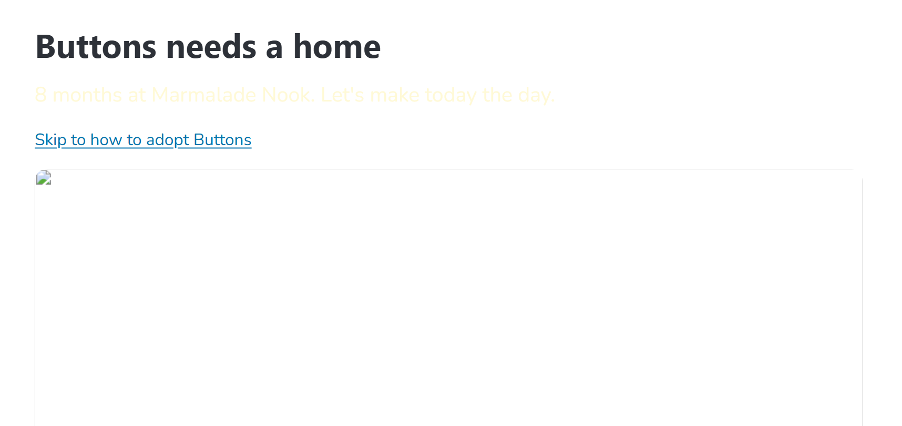
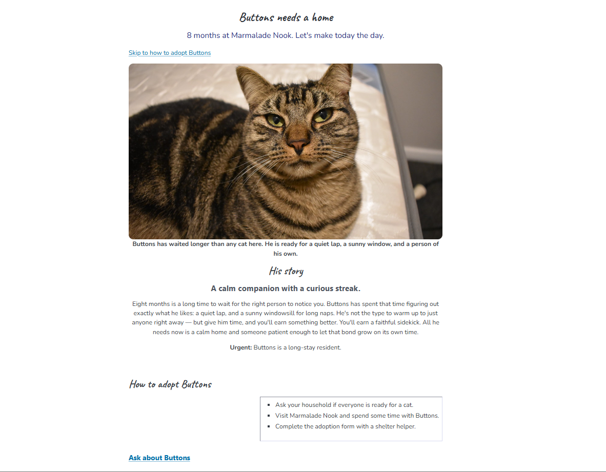

# Buttons' Rescue

The adoption page for Buttons, a long-stay cat at Marmalade Nook.
I inherited it broken, filed every problem as an issue, and fixed it
one commit at a time.

## Before and after

## What I fixed
1. fixed Button's Photo
2. Changed the color of the tagline
3. Fixed justification on page
4. Added Buttons' story
5. Fixed the "skip" link
6. Added some styling to the page
7. Un-bolded/changed font size for some text
8.  Changed the font style of headers

## Credits

Photo: "Cat" by Burnt Pineapple Productions, CC0 1.0.
Live page: https://frankcastle-arch.github.io/buttons-rescue/
